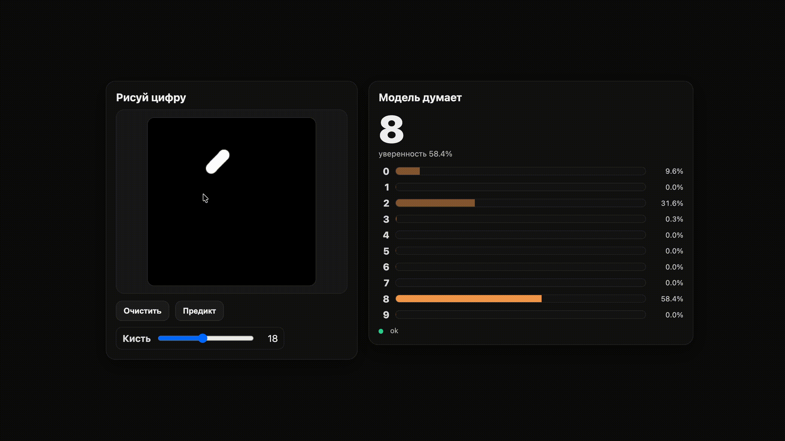

# MNIST Online Classifier

Онлайн-классификатор рукописных цифр (MNIST)

## Архитектура проекта
├── requirements/
│   ├── nn.txt           # зависимости для обучения
│   └── service.txt      # зависимости для backend
│
├── src/
│   ├── nn/              # загрузка данных и обучение
│   │   ├── load_mnist/
│   │   ├── mnist_folders/ # данные mnist
│   │   └── train/
│   │
│   ├── service/         # FastAPI backend
│   │   ├── api/         # роуты
│   │   ├── core/        # конфиг
│   │   ├── ml/          # модель + инференс + preprocess
│   │   └── app.py
│   │
│   ├── web/             # frontend (HTML + CSS + JS modules)
│   │   ├── assets/
│   │   └── index.html
│   │
│   └── models/
│       └── mnist_mlp.pt # обученная модель (создается после обучения)

## Обучение модели

0. `python -m venv venv`
1. ``pip install -r requirements/nn.txt``
2. ``python src/nn/load_mnist/load_mnist.py``
3. ``python src/nn/train/train.py``
4. модель сохранится в ``src/models/mnist_mlp.pt``

## Запуск веб-интерфейса 
1. ``pip install -r requirements/service.txt``
2. ``uvicorn src.service.app:app --reload --port <YOUR_PORT>``

## Пример работы

